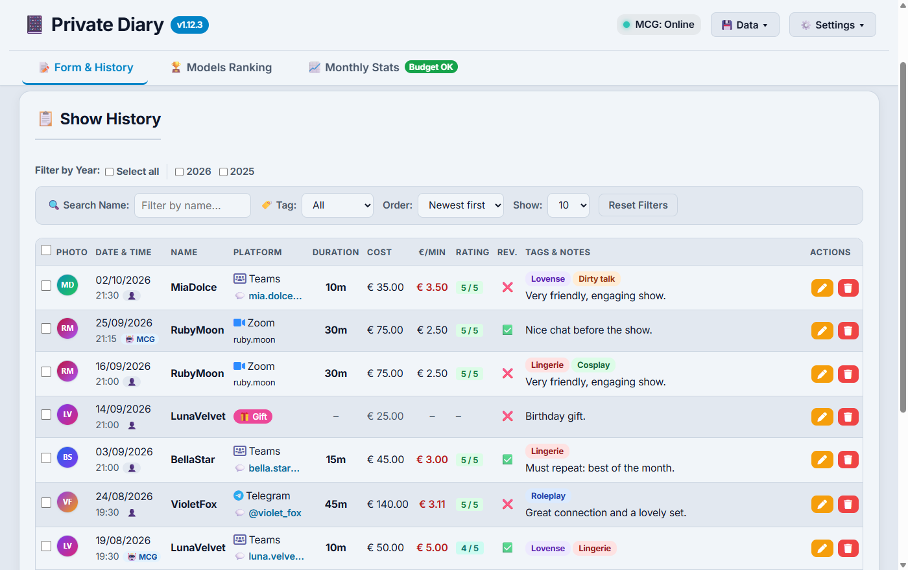
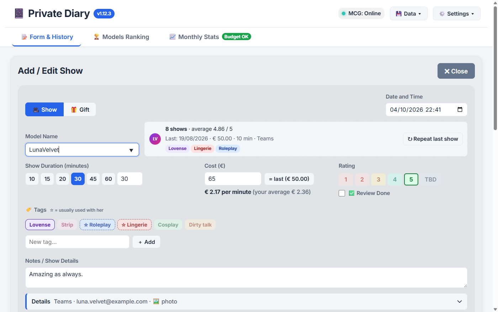
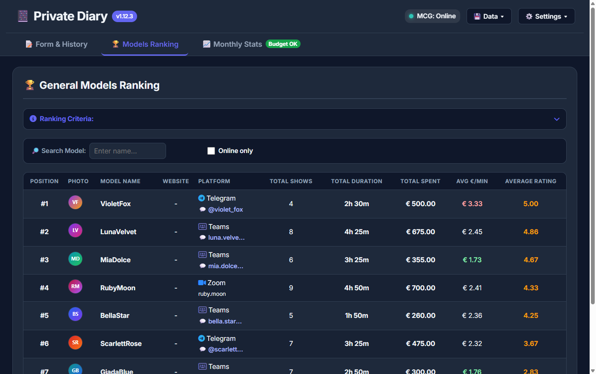
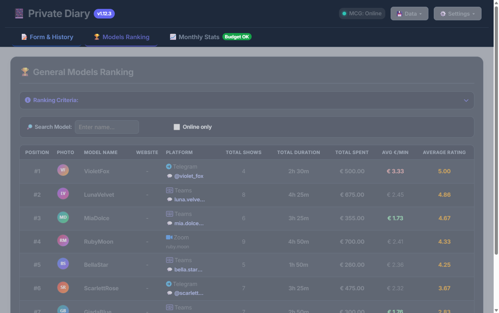
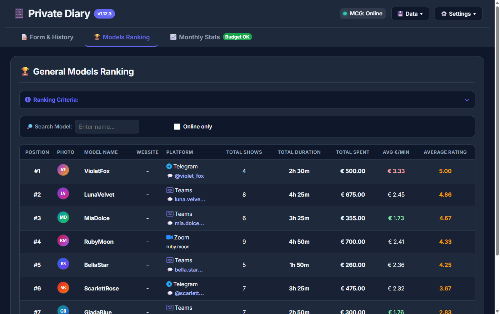

<div align="center">


# Private Diary

**Your private cam-show diary: every session logged, every euro under control, every model in the right place in the ranking.**

[](https://github.com/blackcornercode/private-diary/releases)

[](https://github.com/blackcornercode/private-diary/actions/workflows/test.yml)
[](LICENSE)

🇬🇧 English · [🇮🇹 Italiano](README.it.md)



</div>

## ✨ Features

- 📝 **Smart show log**: model mini-card with her stats, *repeat last show*, quick durations, live **€/min** compared with your average, colour-coded ratings.
- 🏆 **Model ranking**: average rating, number of shows, total time and spending, average €/min, plus a detailed card for every model.
- 🏷️ **Custom tags**: colour tags for the type of show, filters, bulk editing and a "show types" summary for each model.
- 📊 **Budget and charts**: monthly budget with OK/KO badge, spending chart by month or by year, monthly breakdown.
- 🔄 **Mondo Cam Girls sync**: imports your transactions (refunds included) with your own login, shows who is **online**, flags **suspended** or **removed** profiles.
- 🔒 **Privacy first**: PIN lock with auto-lock, blurred photos, neutral window name and icon ("Agenda"), a customisable hotkey to hide the app instantly.
- 🎨 **Four themes**, including *Burgundy & Gold* inspired by mondocamgirls.com, adjustable text size, Italian and English interface.
- 💾 **Your data stays with you**: everything is stored locally, with atomic saves, automatic backup copies and JSON export/import.

## 📸 Screenshots

| Add / edit a show | Model card |
| :---: | :---: |
|  |  |
| **Ranking** (dark theme) | **Spending chart and budget** |
|  |  |

<sub>Screenshots taken with made-up demo data (`npm run screenshot`).</sub>

## ⬇️ Download

1. Download `PrivateDiary-<version>-portable.exe` from the [latest release](https://github.com/blackcornercode/private-diary/releases/latest).
2. Run it: it is a portable app, no installation needed (Windows 10/11).
3. The executable is not digitally signed: if Windows SmartScreen shows a warning, choose **More info › Run anyway**.

## 🚀 Getting started

1. **Add your first show** with **＋ New show**, or import your history from Mondo Cam Girls from the **💾 Data** menu: **🔄 Sync MCG** reads your latest transactions, **📜 Full MCG history** reads every page.
2. **Set a monthly budget** in **Monthly Stats**: the badge next to the tab tells you at a glance whether you are within it.
3. **Protect the app** from **⚙️ Settings › 🔒 Privacy**: PIN, blurred photos, neutral name and the hide hotkey (default **Ctrl+Shift+H**).

The full user guide (in Italian) is in [docs/GUIDA.md](docs/GUIDA.md).

## 🔐 Your data

- Shows, tags and settings are stored only on your computer, in `%APPDATA%\gestioneshow`.
- The app only talks to **mondocamgirls.com**: to check which models are online, to verify profiles and load their photos, and, when you ask for it, to read your transactions with your own login.
- The PIN protects the open app; **it does not encrypt the data files**.

## 🛠️ Build from source

```bash
npm install
npm start          # run the app
npm test           # automated tests
npm run dist       # portable Windows executable in dist/
```

Architecture, tests and build details (in Italian): [docs/SVILUPPO.md](docs/SVILUPPO.md). Version history: [CHANGELOG.md](CHANGELOG.md).

## ⚠️ Disclaimer

Private Diary is an independent project and is **not affiliated with, endorsed or sponsored by Mondo Cam Girls**; names and trademarks belong to their owners. The app only reads pages you could open yourself, with your own account, and keeps everything on your computer. It is meant for adults (18+): use it in accordance with the terms of the sites you use.

## ✉️ Contact

Ideas, bug reports or questions: **[blackcornermail@gmail.com](mailto:blackcornermail@gmail.com)**, or open an [issue](https://github.com/blackcornercode/private-diary/issues/new/choose). In the app: **? › ✉️ Contatti**.

## 📄 License

[ISC](LICENSE) © 2026 The Black Corner
